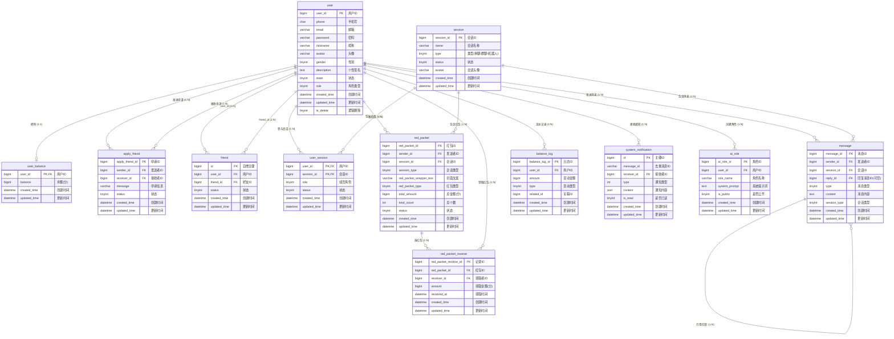

```mermaid
erDiagram
    user ||--o| user_balance : "拥有 (1:1)"
    user ||--o{ apply_friend : "发送申请 (1:N)"
    user ||--o{ apply_friend : "接收申请 (1:N)"
    user ||--o{ friend : "user_id (1:N)"
    user ||--o{ friend : "friend_id (1:N)"
    user ||--o{ user_session : "参与会话 (1:N)"
    session ||--o{ user_session : "包含成员 (1:N)"
    user ||--o{ message : "发送消息 (1:N)"
    session ||--o{ message : "包含消息 (1:N)"
    message ||--o{ message : "引用/回复 (1:N)"
    user ||--o{ red_packet : "发红包 (1:N)"
    session ||--o{ red_packet : "包含红包 (1:N)"
    red_packet ||--o{ red_packet_receive : "拆红包 (1:N)"
    user ||--o{ red_packet_receive : "领取红包 (1:N)"
    user ||--o{ balance_log : "流水记录 (1:N)"
    user ||--o{ system_notification : "接收通知 (1:N)"
    user ||--o{ ai_role : "创建角色 (1:N)"

    user {
        bigint user_id PK "用户ID"
        char phone "手机号"
        varchar email "邮箱"
        varchar password "密码"
        varchar nickname "昵称"
        varchar avatar "头像"
        tinyint gender "性别"
        text description "个性签名"
        tinyint state "状态"
        tinyint role "角色类型"
        datetime created_time "创建时间"
        datetime updated_time "更新时间"
        tinyint is_delete "逻辑删除"
    }

    user_balance {
        bigint user_id PK,FK "用户ID"
        bigint balance "余额(分)"
        datetime created_time "创建时间"
        datetime updated_time "更新时间"
    }

    apply_friend {
        bigint apply_friend_id PK "申请ID"
        bigint sender_id FK "发送者ID"
        bigint receiver_id FK "接收者ID"
        varchar message "申请信息"
        tinyint status "状态"
        datetime created_time "创建时间"
        datetime updated_time "更新时间"
    }

    friend {
        bigint id PK "自增主键"
        bigint user_id FK "用户ID"
        bigint friend_id FK "好友ID"
        tinyint status "状态"
        datetime created_time "创建时间"
        datetime updated_time "更新时间"
    }

    session {
        bigint session_id PK "会话ID"
        varchar name "会话名称"
        tinyint type "类型(单聊/群聊/机器人)"
        tinyint status "状态"
        varchar avatar "会话头像"
        datetime created_time "创建时间"
        datetime updated_time "更新时间"
    }

    user_session {
        bigint user_id PK,FK "用户ID"
        bigint session_id PK,FK "会话ID"
        tinyint role "成员角色"
        tinyint status "状态"
        datetime created_time "创建时间"
        datetime updated_time "更新时间"
    }

    message {
        bigint message_id PK "消息ID"
        bigint sender_id FK "发送者ID"
        bigint session_id FK "会话ID"
        bigint reply_id FK "回复消息ID(可空)"
        tinyint type "消息类型"
        text content "消息内容"
        tinyint session_type "会话类型"
        datetime created_time "创建时间"
        datetime updated_time "更新时间"
    }

    red_packet {
        bigint red_packet_id PK "红包ID"
        bigint sender_id FK "发送者ID"
        bigint session_id FK "会话ID"
        tinyint session_type "会话类型"
        varchar red_packet_wrapper_text "封面文案"
        tinyint red_packet_type "红包类型"
        bigint total_amount "总金额(分)"
        int total_count "总个数"
        tinyint status "状态"
        datetime created_time "创建时间"
        datetime updated_time "更新时间"
    }

    red_packet_receive {
        bigint red_packet_receive_id PK "记录ID"
        bigint red_packet_id FK "红包ID"
        bigint receiver_id FK "领取者ID"
        bigint amount "领取金额(分)"
        datetime received_at "领取时间"
        datetime created_time "创建时间"
        datetime updated_time "更新时间"
    }

    balance_log {
        bigint balance_log_id PK "日志ID"
        bigint user_id FK "用户ID"
        bigint amount "变动金额"
        tinyint type "变动类型"
        bigint related_id "关联ID"
        datetime created_time "创建时间"
        datetime updated_time "更新时间"
    }

    system_notification {
        bigint id PK "主键ID"
        varchar message_id "去重消息ID"
        bigint receiver_id FK "接收者ID"
        int type "通知类型"
        json content "通知内容"
        tinyint is_read "是否已读"
        datetime created_time "创建时间"
        datetime updated_time "更新时间"
    }

    ai_role {
        bigint ai_role_id PK "角色ID"
        bigint user_id FK "用户ID"
        varchar role_name "角色名称"
        text system_prompt "系统提示词"
        tinyint is_public "是否公开"
        datetime created_time "创建时间"
        datetime updated_time "更新时间"
    }
```